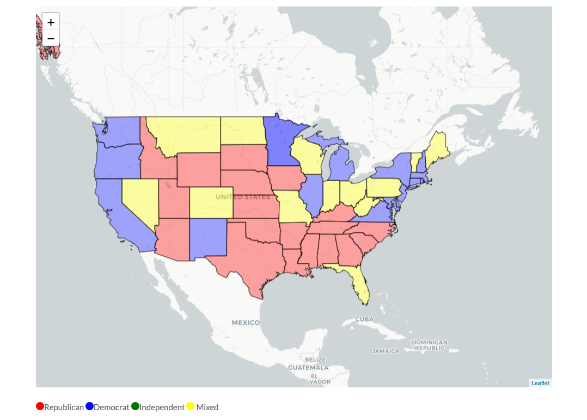
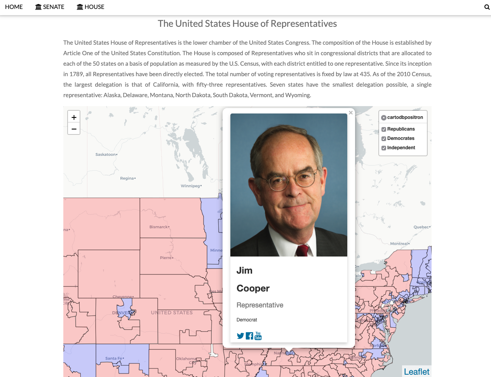

# USA_in_Data
United States of America: A Data Driven Story

For a snapshot of a fully python front and backend webserver of this project see:

[USA in DATA link](https://dcritchlow.pythonanywhere.com/ "USA in DATA")

## Main Webpage

## Senate Webpage

## House Webpage

